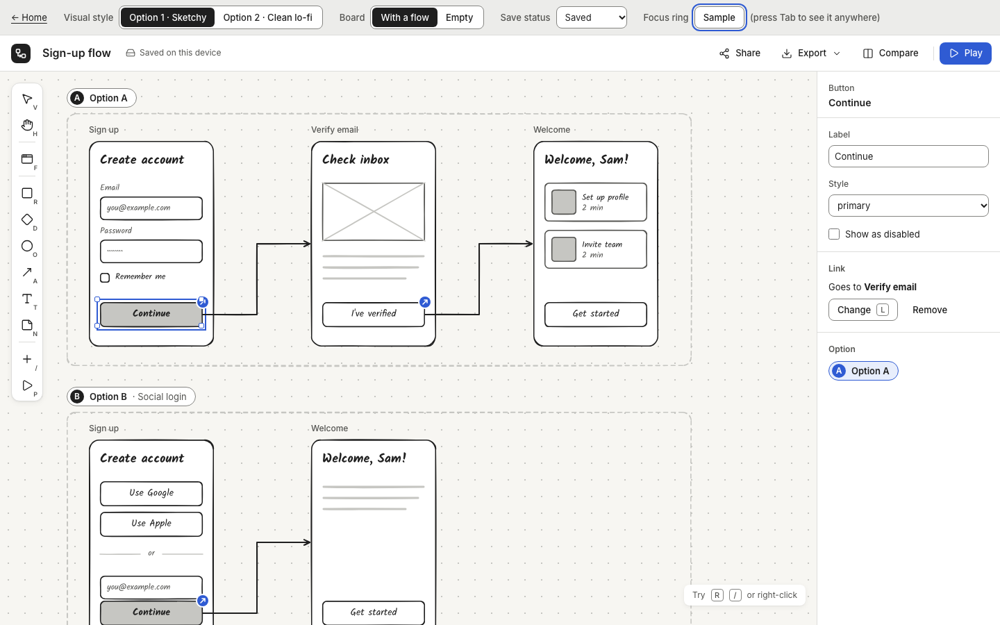
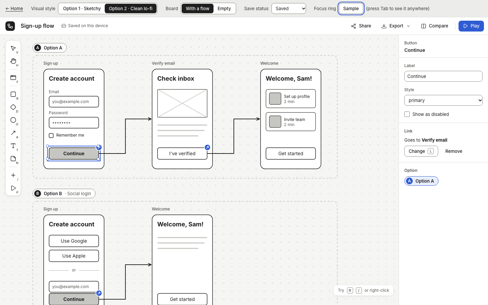
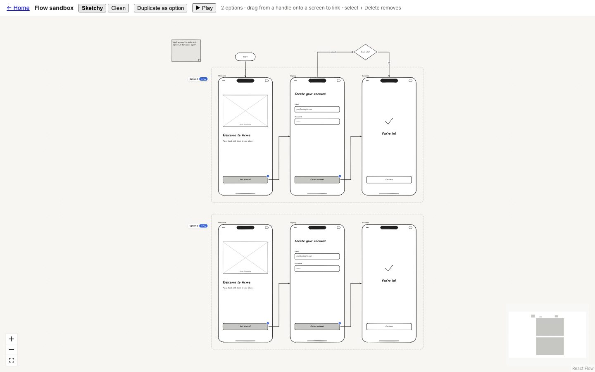
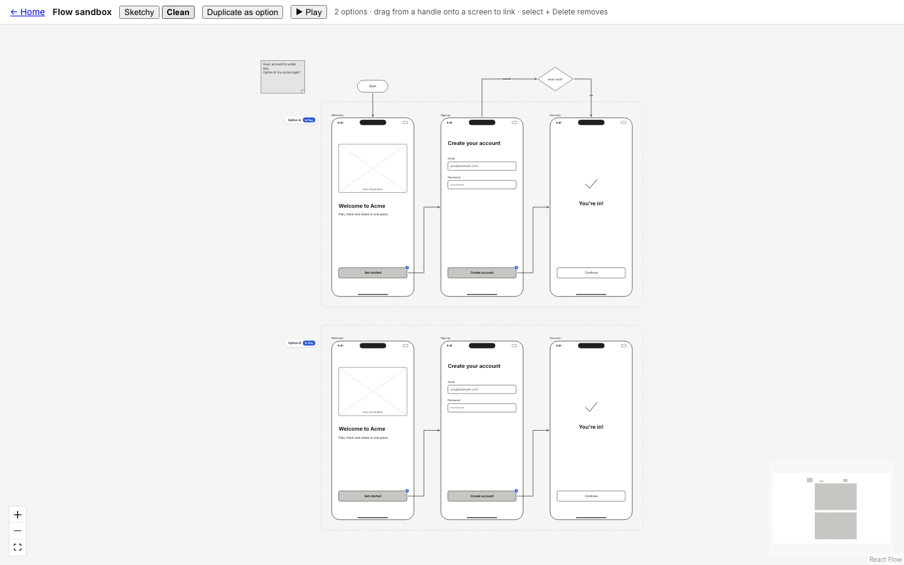

# ⛳ Gate 2 — Visual direction + component kits

_Date: 2026-10-08 · Detail: [design system](../phase-2/design-system.md) · [wireframe kit](../phase-2/wireframe-kit.md) · [diagram & flow](../phase-2/diagram-flow.md)_

## 1. What was done
- **Two visual styles, both fully working:** Option 1 **Sketchy** (hand-drawn lines, handwritten font) and Option 2 **Clean lo-fi** (straight grey lines, neutral font). Both are grey plus one blue, and every text and line colour passes the accessibility contrast standard.
- **Wireframe kit:** all 16 components plus mobile, tablet and desktop frames. They resize gracefully: long text gets "…" and rows that don't fit are hidden.
- **Diagram kit:** process box, decision diamond, start/end pill, sticky note and free text. Arrows stay attached when things move and can have labels. Linked buttons show a small blue "clickable" dot.
- **Options and Play work end to end:** "Duplicate as option" creates an Option B lane below Option A, and ▶ Play clicks through either one.
- **App chrome designed:** left toolbar with shortcut letters, top bar ("Saved on this device", Share, Export, Compare, Play), properties panel on the right, "/" insert search, right-click menu and empty-board hint. 222 automated tests pass.

## 2. What you can see/try
Run `npm install && npm run dev`, then open:
- **/chrome**: the editor layout. Use the toggle at the top to switch **Option 1 ↔ Option 2**.
- **/sandbox**: a live canvas. Drag screens, switch Sketchy/Clean, click **Duplicate as option**, or press **▶ Play** on an option chip. (This is a proof page; the full editor comes in Phase 3.)
- **/gallery**: every component in both styles side by side.

| Option 1 — Sketchy | Option 2 — Clean lo-fi |
|---|---|
|  |  |
|  |  |

Full gallery: [gate-2/gallery.png](gate-2/gallery.png)

## 3. Decisions I need from you
My recommendation is **in bold**. V1 and V3 are the important ones; the rest are quick.

| # | Decision | Options | Recommendation |
|---|---|---|---|
| V1 | **Visual style** | A) Sketchy · B) Clean lo-fi · C) Sketchy by default with a per-board switch (later) | **A**: says "this is a draft, comment on the flow, not the pixels" |
| V2 | Handwritten font (if A) | A) Kalam · B) Patrick Hand · C) Architects Daughter | **A**: most legible at small sizes |
| V3 | **The one accent colour** | A) Calm blue · B) Violet · C) Teal | **A**: passes contrast everywhere and reads as "clickable" |
| V4 | Toolbar position | A) Floating left · B) Floating bottom-centre | **A**: keeps the top free for the title and Play |
| V5 | Shortcut letters on tool buttons | A) Always shown, small · B) Only in tooltips | **A**: teaches shortcuts without a tour |
| K1 | Can paragraph text be a link? ("Already have an account? Log in") | A) Yes, the whole paragraph · B) No, use a button | **A** |
| K2 | Dim the screen behind a modal? | A) No, the modal is just a box · B) Yes, automatically | **A** |
| K3 | Table rows link to other screens? | A) Not in v1 · B) Yes | **A** |
| K4 | Screen name position | A) Above the frame · B) Inside the device chrome | **A** |
| F1 | Where "link to new screen" places it | A) To the right, skipping taken spots · B) Below, as a branch | **A** now |
| F2 | Diagram shapes clickable in Play? | A) No, only screen components · B) Yes | **A** |
| F3 | Links that leave a copied flow | A) Not copied, so each option stays self-contained · B) Copied | **A** |
| F4 | Screen names in an option copy | A) Same names; the lane label shows the option · B) Add "(B)" | **A** |

## 4. Risks and trade-offs
- **Handwritten text at small sizes** looks fine to us but hasn't been tested with users. We can enlarge it if your Gate 3 test shows strain.
- **Speed at 50+ screens is not yet tuned.** Today every drag redraws the whole board. Phase 3 fixes this, and a 60-screen speed test becomes part of the automated checks.
- **Arrows don't yet route around screens**, so an arrow can cross a screen. That's acceptable for the MVP, and smarter routing is in the parking lot.
- **Renaming a flow needs a small data-model addition**, which I'll make in Phase 3; it's a technical change only.

## 5. What happens next if you approve
**Phase 3 — build the real app.** First comes the canvas core: one editor with selection, undo/redo, copy/paste, snapping and shortcuts. Then four agents work in parallel:
- **Wireframe components** on the canvas.
- **Connectors and flows**, including the full Compare view and Play mode.
- **Boards:** the dashboard and autosave.
- **Export and share:** PNG/PDF export, share links and templates.

That ends in **Gate 3**, where you build a 5-screen sign-up flow with Option A/B yourself.
