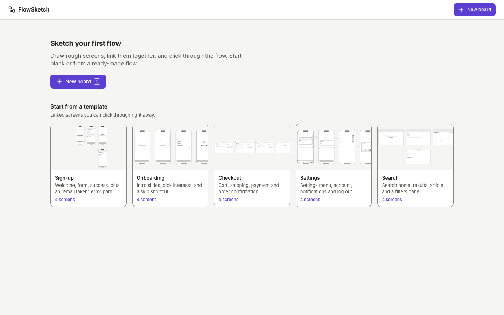
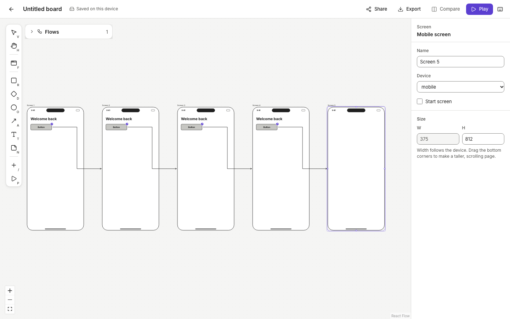
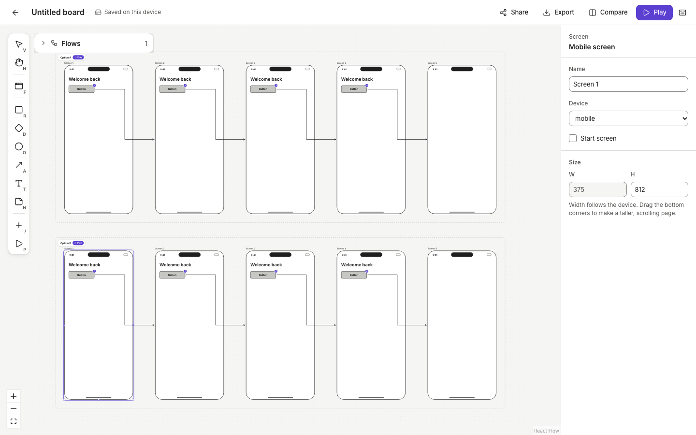
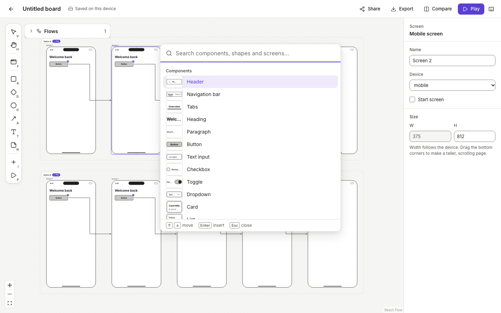
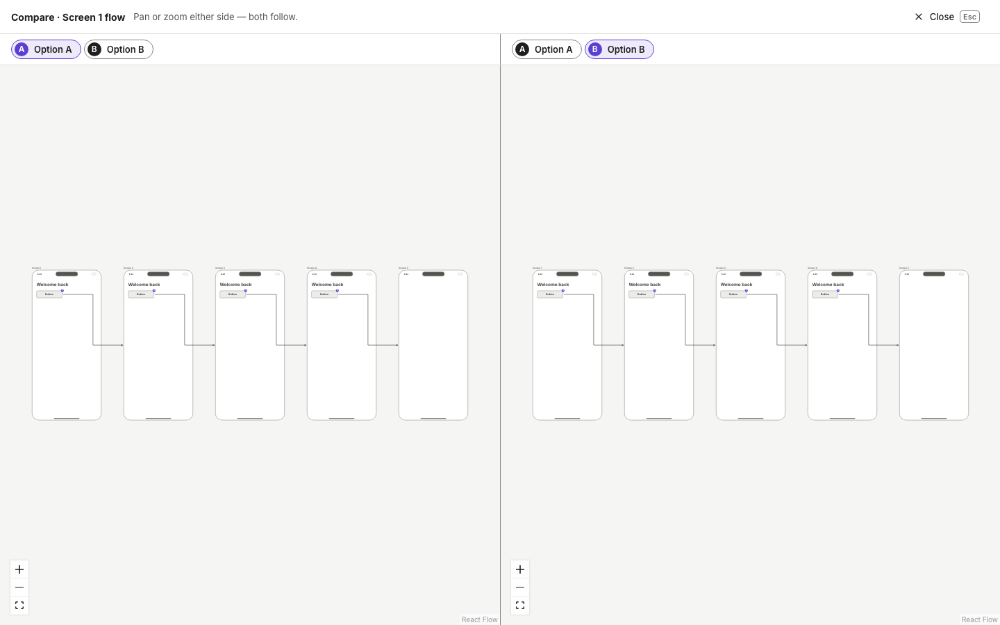
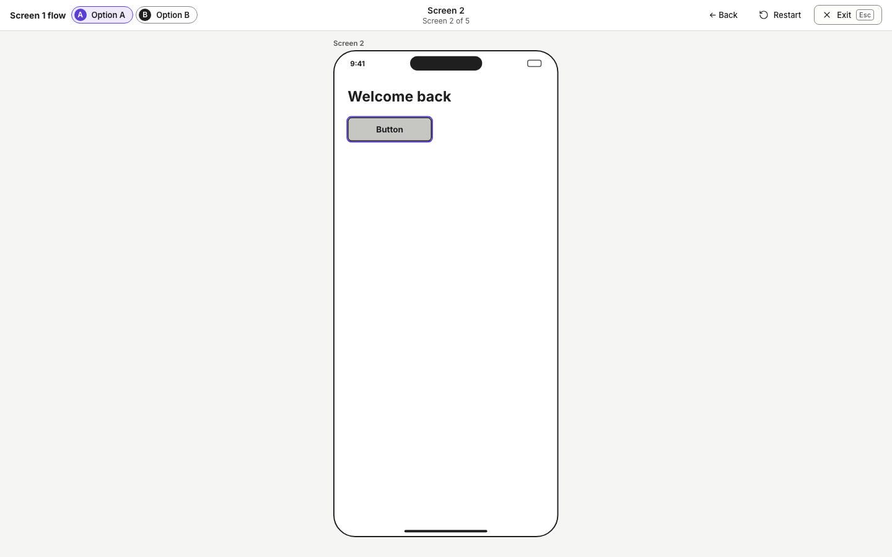

# ⛳ Gate 3 — Working demo — ⏳ AWAITING DIRECTOR

_Date: 2026-10-08 · Detail: [canvas core](../phase-3/canvas-core.md) · [components](../phase-3/components.md) · [flows](../phase-3/flows.md) · [platform](../phase-3/platform.md) · [export & share](../phase-3/export-share.md)_

## 1. What was done
- **The real app works end to end.** It has a dashboard with 5 templates and a full editor with autosave, undo, snapping and copy/paste. A board with 60 screens stays smooth.
- **Screens and components:** add a screen with **F**. Press **/** to search and insert any component, or drag it in. You can edit text in place, resize, and drag elements between screens. The right panel shows the selected item's properties.
- **Flows:** press **L** on a button and choose a screen, or **New screen**. The arrow stays attached. **⇧D** makes Option B, **⇧C** compares options side by side, and **P** clicks through the flow.
- **Share and export:** create a read-only link, or export to PNG/PDF. Everything is saved on this device and survives a refresh.
- **Checks:** 401 logic tests and 38 browser tests pass. A robot runs your exact Gate 3 task (5 screens, Option B, Compare, Play, refresh) every time. While rehearsing it I found and fixed 4 bugs:
  - A new linked screen could appear off-screen.
  - Arrows looped back across their own screen.
  - Compare didn't show arrows.
  - Option labels hid behind the toolbar.

## 2. Try it yourself (≈ 3 minutes)
Run `npm install && npm run dev`, then open **http://localhost:5173**.

**Your task:** build a 5-screen sign-up flow with an Option A/B.
1. **New board**, then **F**, then **1** (mobile), then **Enter**: your first screen.
2. **/**, type "heading", **Enter**. Then **/**, type "button", **Enter**.
3. With the button selected, press **L** and then **Enter** (New screen). You now have a linked next screen. Repeat steps 2–3 until you have 5 screens.
4. Click screen 1, then **⇧D**: Option B appears below. Change something in it.
5. **Compare** (top bar) to see A and B side by side. **Play** (or **P**) to click through. Press **?** any time to see all shortcuts.

| Dashboard | 5 linked screens | Option A + B |
|---|---|---|
|  |  |  |
| **Insert (/) + properties** | **Compare** | **Play** |
|  |  |  |

## 3. Decisions I need from you
My recommendation is **in bold**. D1 is the main one: did the demo meet the bar?

| # | Decision | Options | Recommendation |
|---|---|---|---|
| D1 | **Demo verdict** | A) Approve, start Phase 4 · B) Approve with changes (tell me) · C) Not yet | **A** |
| D2 | Deleting a board that has a share link | A) Also turn the link off · B) Keep the link live | **A**: no surprise "ghost" boards online |
| D3 | Turning off a link after clearing browser data | A) Links expire after 90 days unless reshared · B) Never expire; add a "report" contact · C) Leave as is for MVP | **C** for now; revisit with accounts |
| D4 | "Copy share link" when no link exists yet | A) Visible hint under the item · B) Tooltip · C) Hide the item | **A**: works by keyboard |
| D5 | Dashboard order for returning users | A) Templates first (today) · B) Your boards first; templates shrink to one row after 6 boards | **B** |
| D6 | Can people viewing a shared link download it? | A) PNG only · B) PNG + PDF · C) No downloads | **B**: already built, zero cost |

_Already applied (no action needed): boards made from templates are named after the template ("Checkout"); ⇧D on an element duplicates its whole flow._

## 4. Risks or trade-offs
- **Arrows can cross other screens** when links skip over a screen; they never cross their own screen. A smarter route-around is planned for Phase 4.
- **Exported arrows** take a slightly simpler route than on the canvas. Same connections, small visual difference.
- **Share links only work on this computer** until we deploy. Hosting is about $0–25/month (as in Gate 1).
- **No accounts:** clearing browser data loses boards on that device. This was agreed at Gate 1, and export is the backup.

## 5. If you approve: Phase 4 (in parallel)
- **QA & accessibility:** a keyboard-only walkthrough, contrast checks, Firefox/Safari smoke tests, and more automated tests.
- **Performance:** 50+ screens with many arrows, plus faster loading.
- **Copy & onboarding:** all wording reviewed, a first-run tip tour, empty and error states, and template descriptions.
- Then **⛳ Gate 4**: a quality checklist passed and a deploy plan, ready to share.
