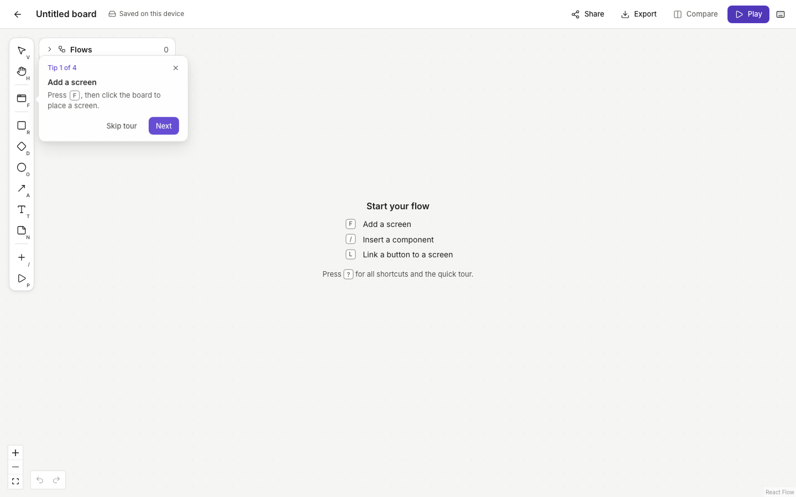
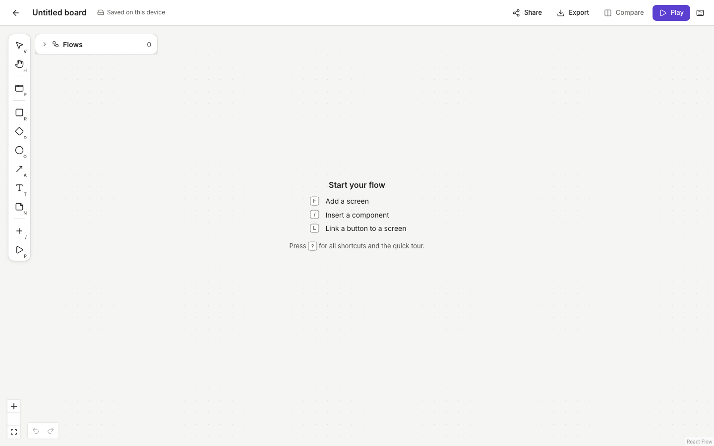

# ⛳ Gate 4 — Launch-ready (UI Workflow Editor) — ⏳ AWAITING DIRECTOR

_Date: 2026-10-09 · Details: [QA & accessibility](../phase-4/qa-accessibility.md) · [Performance](../phase-4/performance.md) · [Copy deck](../phase-4/copy-deck.md) · [Onboarding](../phase-4/onboarding.md)_

## 1. What was done
- **Keyboard and accessibility:** the whole core flow works with the keyboard only. Automatic WCAG AA scans pass on every screen and dialog. Five issues were fixed: missing focus rings, focus getting lost after dialogs, and one contrast failure.
- **Works in Chrome, Firefox and Safari:** a smoke test covers open, play, edit and reload in each.
- **Faster:** lines are drawn about 4× faster, and a board with 60 screens and 86 lines moves at 60 fps. The dashboard downloads half as much code (162 kB instead of 323 kB).
- **Clearer wording:** about 27 messages were rewritten. Every empty and error state now has a helpful message. There's a new 4-tip first-run tour and a "Page not found" page.
- **First-time user check:** a new user can build and play a 3-screen linked flow in 8 steps, about 2 minutes.

## 2. Try it
Open http://localhost:5173 and create a new board. The tour appears once. Press **?** and choose "Show quick tour" to see it again.

| First-run tour | Empty board |
|---|---|
|  |  |

## Quality checklist (Definition of Done)
| Item | Result | Evidence |
|---|---|---|
| New user builds a 3-screen linked flow in under 3 min | ✅ | 8 steps, ~2 min (`e2e/onboarding.spec.ts`) |
| Smooth with 50+ screens | ✅ | 60 screens + 86 lines at 59–60 fps (`e2e/editor-perf.spec.ts`) |
| Nothing lost on refresh | ✅ | Reload tests in 3 browsers (`e2e/smoke.spec.ts`, `editor.spec.ts`) |
| All core actions by keyboard | ✅ | `e2e/a11y-keyboard.spec.ts` |
| WCAG AA contrast | ✅ | Axe scans (`e2e/a11y-axe.spec.ts`) + colour tests |
| Core flows have automated tests, all pass | ✅ | 947 logic + 66 browser tests, 0 failures |
| README: one command to run | ✅ | `npm install && npm run dev` |

## 3. Decisions I need from you
1. **When should the tour appear?** **A) Once, on your first board (recommended)** · B) On every empty board · C) Only when opened from the help dialog
2. **Tour tone:** **A) Plain and calm (recommended)** · B) Playful
3. **Should tips move on automatically when you do the action?** **A) Yes (recommended)** · B) No, only with a Next button
4. **The small "React Flow" credit in the corner:** **A) Keep it (recommended, free)** · B) Hide it (allowed, but the makers ask hiders to sponsor them)
5. **Safari tip:** Safari's Tab key skips buttons unless you hold Option. **A) Mention it in the shortcuts dialog (recommended)** · B) Leave it out
6. **Sharing with others:** **A) Put it online on Vercel now (recommended; free while it's a demo, $20/month before any commercial use)** · B) Keep it running only on this computer for now

## 4. Risks or trade-offs
- Boards are saved only in this browser on this device. Clearing browser data deletes them. Accounts and cloud saving are on the "Later" list.
- Share links work only while the app is running here, until we put it online (decision 6).
- Very large boards (200+ screens) may pause briefly when you drop a screen. Moving that work to the background is in the parking lot.

## 5. If you approve
- I apply your choices and deploy to Vercel (if you choose 6A), then send you a public link.
- Parking lot for after launch:
  - Templates from inside the editor
  - A proper help menu
  - An offline banner
  - Background line routing
  - Real-time collaboration
  - AI flow generation
  - Version history
