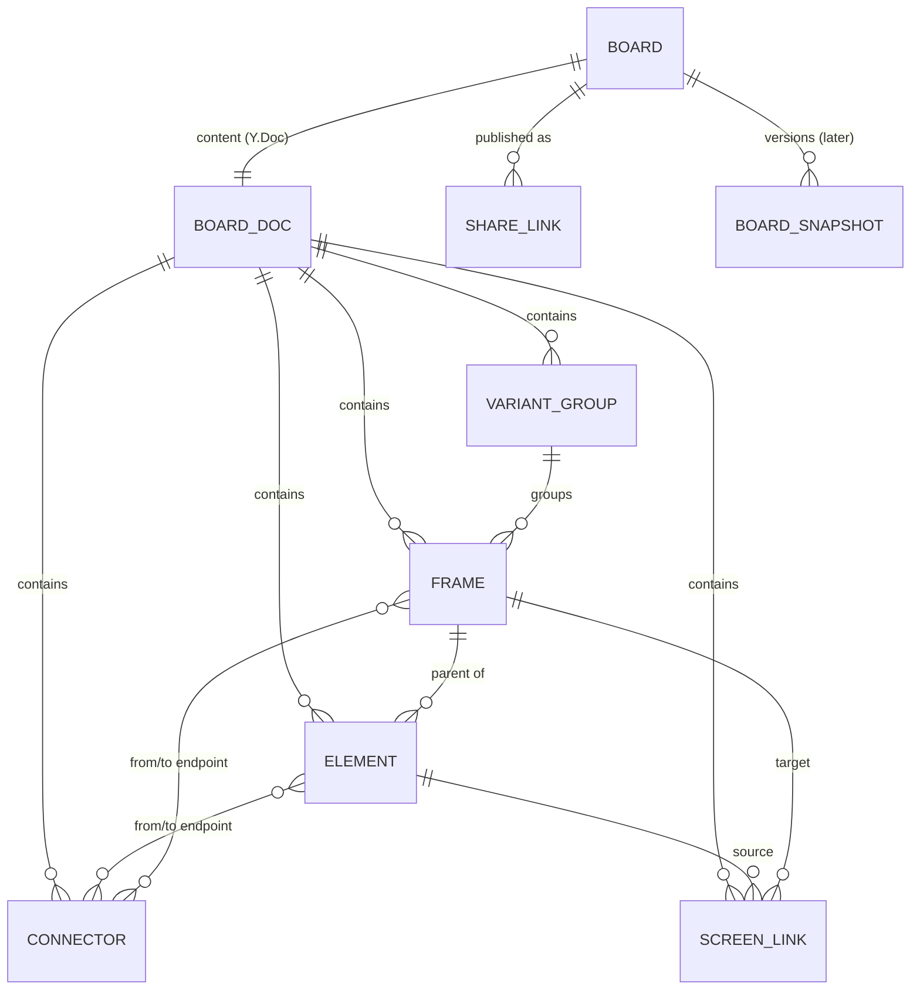

# FlowSketch — Technical Architecture (Phase 1)

_Author: Technical Architect Agent · Date: 2026-10-08 · Status: Proposal for Director review_

## 1. Plain-language summary (for the Director)

- **Drawing engine:** We build on **React Flow**, a free, widely used open-source library for "boxes connected by arrows", so we don't reinvent the canvas and pay no licence fees.
- **Why not tldraw:** tldraw is the most complete option, but its licence **requires a paid key to go live** (no public price; reported around **$6,000/year**), so we keep it as a paid fallback only.
- **App technology:** A single-page web app in **React + TypeScript**, the most common and best-supported web tooling.
- **Saving:** Boards save automatically **in your browser** every moment you edit, so nothing is lost on refresh and the app works without an account.
- **Sharing:** Clicking "Share" uploads a **read-only copy** to a small online database and gives you a link.
- **Hosting:** The app runs on **Vercel** and the database on **Supabase**; both are free for a demo and roughly **$45–$70/month** at 1,000 users.
- **Export:** PNG and PDF files are made **in the browser**, so no extra server is needed.
- **Future-proofing:** Each board's data is stored in a format (**Yjs**) built for real-time co-editing and history, so those features can be added later without rewriting.
- **Quality:** Automated tests check logic, click through the real app in a browser, and scan for accessibility problems on every change.
- **Running it:** A developer runs **one command** (`pnpm dev`) to start everything locally.

## 2. Canvas library options

| Criterion | **React Flow (xyflow)** | tldraw SDK | Excalidraw | Konva (+react-konva) | Custom (SVG/Canvas) |
|---|---|---|---|---|---|
| Licence / cost | MIT, free (optional "Pro" examples subscription, not required) | Source-available; **production needs licence key**: trial 100 days, hobby (free, non-commercial, watermark), commercial (sales quote; ~$6k/yr reported) | MIT, free | MIT, free | Free, but high build cost |
| Custom shapes (wireframe components) | ✅ Any React/HTML component as a node; screens = nodes, components = child nodes | ✅✅ First-class custom shapes & tools | ❌ No custom-element API (only embeds); hard to add device frames/components | ✅ Any drawn shape, but no HTML/text layout helpers | ✅ Whatever we build |
| Connectors that stay attached | ✅✅ Core feature: edges bound to **handles**, which can sit on a button _inside_ a screen; labels, routing (step/smoothstep/bezier) | ✅✅ Bindings, labelled arrows | ✅ Arrow binding to shapes (not sub-parts) | ❌ Build yourself | ❌ Build yourself |
| Frames / grouping | ✅ Parent/child (sub-flows) | ✅ Frames | ✅ Frames | ⚠️ Groups only | ❌ |
| Undo, snap guides, copy/paste | ⚠️ We build (small: Yjs UndoManager; helper-line example exists) | ✅ Built in | ✅ Built in | ❌ | ❌ |
| Performance, 50+ screens | ✅ Viewport culling (`onlyRenderVisibleElements`), memoised nodes; fine to low thousands of DOM nodes | ✅ Culling, very optimised | ✅ Canvas render | ✅✅ Canvas render | Depends |
| Accessibility | ✅ Keyboard focus/move of nodes & edges, ARIA labels, live region built in | ✅ Good keyboard support | ⚠️ Canvas; limited screen-reader | ❌ Canvas; nothing for SRs | ❌ Build yourself |
| Export PNG/PDF | ✅ Documented `html-to-image` approach | ✅ Built in | ✅ Built in | ✅ `toDataURL` | Build |
| Collab-readiness | ✅ We own the data → Yjs; official collab examples | ✅✅ tldraw sync (also licensed) | ✅ Has collab (own protocol) | Data is ours | Data is ours |
| Lo-fi/sketchy look | ✅ CSS + Rough.js (MIT) | ✅ Native hand-drawn style | ✅✅ Native | ✅ Rough.js | ✅ |
| Est. MVP effort | Medium | **Lowest** | High (fighting the model) | Very high | Highest |

**Recommendation: React Flow (xyflow, MIT).** FlowSketch's core is "screens are nodes; buttons inside screens connect to other screens" — that is exactly React Flow's handle/edge model, and the wireframe components are just React components rendered as HTML (crisp text, real focusable elements, good accessibility). We own the data model (stored in Yjs), so we are never locked into the library. Gaps (undo, snap guides, free-form diagram shapes) are small and well-trodden. **tldraw** is technically the strongest and would save ~1–2 weeks, but needs a paid production licence with unpublished pricing — see Decision D1. Excalidraw and Konva would force us to build the wireframe/connector model ourselves; a fully custom engine is the slowest and riskiest.

## 3. Recommended stack

| Layer | Choice | Why |
|---|---|---|
| Language | TypeScript (strict) | Catches errors early; shared types front + back |
| Frontend | React 19 + Vite (SPA) | No SEO/SSR needs; fastest dev loop; React Flow is React-native |
| Canvas | @xyflow/react (React Flow 12) | See §2 |
| Sketchy style | Rough.js + a hand-drawn font (OFL-licensed, e.g. Virgil-like alternative) in grayscale tokens | Lo-fi by design; WCAG-AA greys |
| UI chrome | Radix UI primitives + Tailwind CSS | Accessible menus/dialogs out of the box; calm, consistent styling |
| Document state | **Yjs** (CRDT) as source of truth, mirrored into React Flow | Undo/redo (Y.UndoManager), collab & history later for free |
| UI state | Zustand | Tiny, simple (tool mode, selection, panels) |
| Local persistence | `y-indexeddb` + `idb` for board index | Autosave every change; works offline; survives refresh |
| Backend (share links only) | One Hono API route on Vercel Functions | Simplest server; easy to move to Cloudflare later |
| Database | Supabase Postgres (+ Storage for thumbnails) | Managed Postgres, generous free tier, auth ready for "teams" later |
| Export | `html-to-image` → PNG; `jsPDF` wraps PNG(s) → PDF | All client-side; no rendering server |
| Testing | Vitest + Testing Library; Playwright; `@axe-core/playwright` | Unit, e2e, accessibility in one toolchain |
| Tooling | pnpm workspaces, ESLint, Prettier, GitHub Actions CI | Standard, one-command setup |

## 4. Data model

Principles: every record has a stable `id` (nanoid), lives in **flat maps keyed by id** (no deep nesting → conflict-free merges), references others by id, and carries `createdAt/updatedAt`. Ordering uses fractional index strings (`z`), not array positions. This maps 1:1 onto a `Y.Doc` (one `Y.Map` per collection), which is what makes real-time collab and version history additive later.

```ts
type ID = string;                      // nanoid
type FIndex = string;                  // fractional index for z-order / sibling order

interface Board {                      // stored in index DB + server; doc content in Y.Doc
  id: ID; title: string; ownerId?: ID; // ownerId/teamId unused in MVP
  teamId?: ID; templateId?: string;
  schemaVersion: number;               // for migrations
  createdAt: number; updatedAt: number; thumbnailUrl?: string;
}

interface BoardDoc {                   // == Y.Doc { meta, frames, elements, connectors, links, variants }
  frames: Record<ID, Frame>;
  elements: Record<ID, Element>;
  connectors: Record<ID, Connector>;
  links: Record<ID, ScreenLink>;
  variants: Record<ID, VariantGroup>;
}

interface Frame {                      // a screen (device frame)
  id: ID; kind: 'frame'; name: string;
  device: 'desktop' | 'tablet' | 'mobile';
  x: number; y: number; w: number; h: number; z: FIndex;
  variantId?: ID;                      // which flow option it belongs to
  isStart?: boolean;                   // prototype entry point
}

type ElementType =
  | 'header' | 'nav' | 'button' | 'input' | 'checkbox' | 'toggle' | 'dropdown' | 'card'
  | 'list' | 'table' | 'image' | 'text' | 'heading' | 'modal' | 'tabs' | 'icon'      // wireframe kit
  | 'rect' | 'diamond' | 'ellipse' | 'sticky' | 'label';                           // diagram kit

interface Element {
  id: ID; type: ElementType;
  parentId?: ID;                       // frame id if inside a screen; undefined = on canvas
  x: number; y: number; w: number; h: number; z: FIndex;  // relative to parent
  props: Record<string, unknown>;      // e.g. { label: 'Sign up', state: 'checked' }
  variantId?: ID;
}

interface Endpoint { nodeId: ID; anchor?: 'top'|'right'|'bottom'|'left'|'auto' }  // frame or element

interface Connector {                  // visual arrow on the canvas
  id: ID; from: Endpoint; to: Endpoint;
  label?: string; style: 'straight' | 'step' | 'curved'; arrowheads: 'end' | 'both' | 'none';
  variantId?: ID;
}

interface ScreenLink {                 // prototype navigation: element → screen
  id: ID; sourceElementId: ID; targetFrameId: ID;
  trigger: 'click'; connectorId?: ID;  // usually drawn as a connector too
}

interface VariantGroup {               // "Option A / Option B"
  id: ID; flowId: ID;                  // variants sharing a flowId are compared side by side
  label: string; color?: string;       // grayscale tint
  duplicatedFromId?: ID; order: FIndex;
}
```



Server-side tables (MVP: only `share_links`): `share_links(id, slug UNIQUE, board_title, doc_update BYTEA, created_at, revoked_at)`; later: `boards`, `board_updates` (append-only Yjs updates), `board_snapshots` (version history), `users`, `teams`, `memberships`.

## 5. Storage & sync plan

**MVP (local-first, no accounts)**
1. Each board = one `Y.Doc`, persisted by `y-indexeddb` on every change (debounced batching is built in). Board list/metadata in a small IndexedDB store. → "Nothing lost on refresh."
2. Undo/redo = `Y.UndoManager` scoped to the local user's changes.
3. **Share**: client encodes the doc (`Y.encodeStateAsUpdate`, compressed) → `POST /api/share` → server stores in Postgres and returns an unguessable slug (`/s/{22-char id}`). Viewer route loads it read-only. Re-sharing updates the same slug; "Stop sharing" sets `revoked_at`. Size cap (e.g. 5 MB) + rate limit.
4. Schema migrations run on load via `schemaVersion`.
5. Risk note: browser storage is per-device and can be cleared by the user; we show "Saved on this device" and offer "Export board file (.flowsketch JSON)" as backup.

**Later (no data-model rework)**
- **Accounts & cloud sync:** Supabase Auth; push Yjs updates to `board_updates`; boards follow the user across devices.
- **Real-time collaboration:** add a Yjs provider — Hocuspocus (MIT, self-host) or Y-Sweet/PartyKit/Liveblocks (hosted). Cursors via Yjs Awareness. Comments = new `comments` map in the doc.
- **Version history:** periodic `Y.snapshot` / compacted state stored in `board_snapshots`; restore = apply snapshot.
- **AI generation:** server function emits the same `Frame/Element/Connector` records → inserted as one Yjs transaction (undoable).

## 6. Hosting plan & estimated monthly cost (USD)

Assumptions: boards mostly local; server only stores shared snapshots (~50–500 KB each); static app served from CDN.

| Stage | Vercel | Supabase | Other | **Total / month** |
|---|---|---|---|---|
| Prototype / demo | Hobby $0 (non-commercial only) | Free $0 (pauses after 1 week idle) | Domain ~$1 | **≈ $0–1** |
| 100 users | Pro $20 (1 seat; needed for commercial use) | Free, or Pro $25 to avoid pausing/get backups | Error monitoring (Sentry free) | **≈ $20–45** |
| 1,000 users | Pro $20 + usage (well within included bandwidth) | Pro $25 (8 GB DB included) | Sentry/analytics free tiers | **≈ $45–70** |

**Licence fees:** **$0** with the recommended stack (all MIT/OFL). If we chose **tldraw**, add a commercial licence — price via sales only; third-party reports cite **~$6,000/year (~$500/month)**, startup discounts available. Later real-time collab: self-hosted Hocuspocus ≈ $5–20/month on a small VM; hosted options ~$0–100+/month depending on usage.

## 7. Performance plan (50+ screens)

- **Budget:** 60 fps pan/zoom and < 100 ms selection/drag response with 60 screens × ~20 components (~1,300 nodes) + 100 connectors on a mid-range laptop; initial load < 2 s for such a board.
- `onlyRenderVisibleElements` (viewport culling) + memoised node components; stable callbacks; no per-frame React state for pan/zoom.
- **Level-of-detail:** below ~40 % zoom, screens render as a single lightweight placeholder (title + cached thumbnail) instead of child components.
- Wireframe components are cheap HTML/CSS; Rough.js sketch paths are generated once per size and cached.
- Yjs → React Flow mirroring uses granular updates (only changed records re-render).
- A **seeded 60-screen perf fixture** and a Playwright trace-based check run in CI to catch regressions.

## 8. Testing & quality plan

| Layer | Tool | What |
|---|---|---|
| Unit | Vitest + Testing Library | Data model ops (duplicate variant, link integrity on delete, migrations), export utilities, keyboard shortcuts |
| E2E | Playwright (Chromium, Firefox, WebKit) | Core flows: create board → add 3 screens → link button → prototype click-through; Option B + compare; refresh persists; export PNG/PDF downloads; share link read-only |
| Accessibility | `@axe-core/playwright` on every page/state + manual keyboard checklist | Zero serious/critical axe violations; all core actions reachable by keyboard; AA contrast via tokens |
| Performance | Playwright + 60-screen fixture | Frame-time budget |
| Static | TypeScript strict, ESLint (incl. jsx-a11y), Prettier | Run in CI + pre-commit |
| CI | GitHub Actions | Lint → unit → e2e/axe on every PR; Vercel preview deploy per PR |

## 9. Repo structure & one-command run

```
flowsketch/
├─ apps/
│  ├─ web/            # React + Vite SPA (canvas, dashboard, prototype & viewer modes)
│  └─ api/            # Hono routes (share links) → Vercel Functions
├─ packages/
│  ├─ model/          # TS types, Yjs schema, migrations, pure ops (shared by web/api)
│  ├─ wireframe-kit/  # lo-fi component renderers + device frames
│  └─ templates/      # 3–5 starter flows as JSON
├─ e2e/               # Playwright + axe specs, perf fixture
├─ docs/
└─ package.json       # pnpm workspaces
```

**One command:** `pnpm dev` (after `pnpm install`; README can offer `pnpm i && pnpm dev`) starts web + API together. Locally the API uses an in-memory/SQLite share store, so **no Supabase account or secrets are needed to run**; `pnpm test`, `pnpm e2e` run the suites.

## 10. Decisions for the Director

**D1 — Canvas library (affects cost & timeline)**
- **A. React Flow (free, MIT)** — $0 licence; ~1–2 extra weeks to build undo, snap guides and free-form shapes. ✅ **Recommended**
- B. tldraw SDK (paid) — fastest, most polished canvas; production licence via sales (reported ~$6k/yr; startup discount possible); vendor dependency.
- C. tldraw under free hobby licence — only if FlowSketch stays non-commercial; "made with tldraw" watermark on canvas.

**D2 — Accounts in MVP (affects UX & timeline)**
- **A. No accounts; boards saved on this device; share via link** ✅ **Recommended** (fastest, zero friction)
- B. Sign-in from day one so boards sync across devices (+~1 week, privacy/legal work).

## 11. Risks

| Risk | Impact | Mitigation |
|---|---|---|
| Browser storage cleared / device lost (local-first) | Users lose boards | "Saved on this device" messaging, export/import board file, persistent-storage request (`navigator.storage.persist`), accounts later |
| Custom undo/snap/free-shape work underestimated | Timeline slip | Time-box; reuse React Flow helper-line pattern; fall back to D1-B if blocked |
| DOM export fidelity (fonts, Safari) with html-to-image | Ugly exports | Embed fonts, export tests in 3 browsers; fallback SVG path |
| Accessibility of a spatial canvas | Fails quality bar | Keyboard-first design: outline/list view of screens & links, arrow-key move, focus management; axe in CI |
| Public share links leak data | Privacy | Unguessable slugs, revoke, no indexing (`noindex`), size/rate limits |
| Vercel Hobby forbids commercial use | Terms breach | Move to Pro ($20) before any commercial launch |
| tldraw licence terms change (if chosen) | Cost/lock-in | Own data model; keep adapter boundary |

## 12. Parking lot (not in scope)

- Hosted real-time provider choice (Hocuspocus vs Y-Sweet vs Liveblocks) — decide when collab is scheduled.
- Server-side export (headless Chromium) for very large boards.
- Figma/Whimsical import, Mermaid import/export.
- Offline PWA install.
- Canvas (WebGL) renderer if boards grow far beyond 200 screens.

## 13. Sources

- tldraw licence text (production use requires licence key): https://github.com/tldraw/tldraw/blob/main/LICENSE.md
- tldraw licensing docs (trial 100 days, commercial via sales, hobby with watermark): https://tldraw.dev/community/license
- tldraw pricing page (no public price; startup discount; checked 2026-10-08): https://tldraw.dev/pricing
- Third-party report of ~$6,000/yr tldraw commercial price (unverified by vendor): https://biggo.com/news/202509190115_tldraw_SDK_4.0_Licensing_Debate
- React Flow / xyflow (MIT): https://github.com/xyflow/xyflow · docs: https://reactflow.dev (accessibility, performance, download-image, collaborative examples)
- Excalidraw (MIT): https://github.com/excalidraw/excalidraw
- Konva (MIT): https://github.com/konvajs/konva
- Yjs (MIT) & y-indexeddb: https://github.com/yjs/yjs · https://docs.yjs.dev
- Hocuspocus: https://tiptap.dev/docs/hocuspocus
- Rough.js: https://roughjs.com · html-to-image: https://github.com/bubkoo/html-to-image · jsPDF: https://github.com/parallax/jsPDF
- Vercel pricing: https://vercel.com/pricing · Supabase pricing: https://supabase.com/pricing
- Playwright accessibility testing: https://playwright.dev/docs/accessibility-testing
