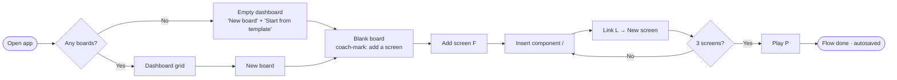

# FlowSketch — UX Architecture (Phase 1)

Owner: UX Architect Agent · Status: Draft for Director decision · Source: `docs/BRIEF.md`

---

## 1. Plain-language summary (for the Product Director)

- **One canvas, one idea.** Screens are just big boxes on an endless whiteboard. You draw a screen, drop simple parts into it (buttons, inputs, lists), and draw arrows between them. There is no separate "diagram mode" — wireframes and flowcharts live together.
- **Linking is the hero action.** Select any button and press **L** (or drag its little dot) to point it at another screen — or create a new screen in one step. That's how a new user gets a 3-screen flow in under 3 minutes.
- **Alternatives are built in.** Select a flow, choose **"Duplicate as Option B"**, change what you want, then open **Compare** to see A and B side by side. Options are clearly labelled so teams can discuss them.
- **Click-through to feel it.** Press **P** to "play" a flow like a clickable prototype; press **Esc** to return to the canvas exactly where you were.
- **Calm and accessible by default.** Grayscale, sketchy look, few visible controls, everything reachable by keyboard, autosave always on, and a read-only share link for stakeholders.

---

## 2. User journeys (top 5 tasks)

Counts assume default settings; "clicks" = pointer clicks/drags, "keys" = shortcut presses. Typing names is not counted.

### J1 — First run → 3-screen linked flow (target < 3 min)

| # | Step | Mouse | Keyboard |
|---|------|-------|----------|
| 1 | Land on Dashboard (empty) → "New board" | 1 click | `N` on dashboard |
| 2 | Board opens with a coach-mark: "Press F or click Screen to add your first screen". Choose device (Mobile default) | 1 click (toolbar) + 1 click (canvas) | `F`, `Enter` (places at viewport centre) |
| 3 | Add a button: open Insert (`/`), type "but", Enter → placed inside selected screen | 2 clicks (Components panel → Button) | `/`, type, `Enter` |
| 4 | Link button to a **new** screen: hover button → click "+→" quick-link handle → "New screen" | 2 clicks | `L`, `Enter` ("New screen" is first option) |
| 5 | Repeat 3–4 on screen 2 to create screen 3 | 4 clicks | 6 keys |
| 6 | Optional: press `P` to click through and verify | 1 click | `P` |

**Total ≈ 11 clicks or ≈ 14 keys, ~90 s for a new user.** New screens auto-place to the right with a 120 px gap and an arrow already drawn; no manual layout needed.

### J2 — Add "Option B" and compare side by side

1. Select the flow: click any screen in it → `Shift+F` "Select flow" (selects all linked screens + connectors) — **1 click + 1 key** (or marquee drag).
2. `Cmd/Ctrl+Shift+D` "Duplicate as option" (also in right-click menu and selection toolbar) — **1 key / 2 clicks**. Copy appears below the original; both get labels: "Option A" / "Option B" (editable inline).
3. Edit Option B (normal editing).
4. Open Compare: `Shift+C` or "Compare options" in the option label menu — **1 key / 2 clicks**. Split view shows A and B in synced panes; `Esc` exits.

**Total: ~4 interactions.**

### J3 — Click through a flow (prototype mode)

1. Select a starting screen (or none → the flow's start screen is used) — 1 click.
2. `P` or toolbar "Play" — 1 key / 1 click. Full-window view of the screen; linked elements show a subtle outline on hover/focus.
3. Click linked elements (or `Tab` to them + `Enter`) to advance; `Backspace`/`←` goes back; `→` follows the only link if exactly one exists.
4. `Esc` returns to the canvas, camera centred on the last viewed screen.

### J4 — Start from a template

1. Dashboard → "Start from template" (or empty-board coach-mark "Use a template") — 1 click.
2. Template gallery dialog: 5 cards (Sign-up, Onboarding, Checkout, Settings, Search), each with thumbnail + screen count — 1 click to select.
3. "Use template" — 1 click (`Enter`). New board named "Checkout (copy)" opens, zoomed to fit.
Inside an existing board: Insert (`/`) → "Templates" tab inserts the flow at viewport centre. **Total: 3 clicks.**

### J5 — Export / share

- **Export PNG/PDF:** `Cmd/Ctrl+Shift+E` or Share menu → Export → choose scope (Selection / Current option / Whole board), format (PNG/PDF), background (white/transparent) → "Export". **2–3 clicks.** Defaults remember last choice.
- **Share read-only link:** top-right "Share" → toggle "Anyone with the link can view" → "Copy link" (toast confirms). **3 clicks first time, 2 after.** Link can be turned off (invalidates).

---

## 3. Information architecture

| Area | Purpose | What lives here |
|------|---------|-----------------|
| **Dashboard** (`/`) | Find & start work | Board grid (thumbnail, name, last edited), New board, Start from template, search/filter by name, board context menu (rename, duplicate, delete, copy share link). |
| **Board editor** (`/b/:id`) | Sketch, link, explore | Top bar (back to dashboard, board name, autosave status, Play, Share), left toolbar (tools), Components panel (collapsible), canvas, contextual selection toolbar, Inspector (only when selection; label, device size, link target, option label), zoom/minimap controls bottom-right, help (`?`). |
| **Compare view** (overlay of editor) | Side-by-side options | 2 (max 3) synced panes, option picker per pane, "Sync pan/zoom" toggle, exit. Read-only in MVP. |
| **Prototype mode** (overlay of editor) | Click-through | One screen at a time, breadcrumb of visited screens, back/restart/exit controls, "Showing Option A" switcher. |
| **Share view** (`/s/:token`) | Stakeholder viewing | Read-only canvas (pan/zoom), Play, Compare, Export PNG. No editing UI. Banner: "View only · made with FlowSketch". |

Settings are deliberately minimal: a single board menu (rename, duplicate, delete, toggle sketchy/clean style, grid on/off).

---

## 4. Screen inventory (MVP)

**Dashboard**
- Dashboard — board grid + primary actions.
- Empty dashboard — welcome, "New board" / "Start from template".
- Template gallery dialog — 5 starter flows with previews.
- Rename board (inline) / Delete board confirm dialog — with 10 s undo toast instead of hard confirm where possible.

**Board editor**
- Top bar — name, save status, Play, Share, board menu.
- Tool bar (left) — tools listed in §5.
- Components panel — wireframe kit + diagram kit + Templates tab, searchable.
- Insert palette (`/`) — keyboard quick-search for any component/shape/template.
- Selection toolbar (floating) — Link, Duplicate as option, Align, Group, Delete.
- Inspector panel (right, contextual) — properties of selection: text, device type, variant (e.g. checked/unchecked), link target, option label.
- Link picker popover — list of screens (search) + "New screen" (default).
- Option label chip — on-canvas label above each option group; menu: rename, compare, delete option.
- Context menu (right-click / `Shift+F10`) — same actions as selection toolbar + copy/paste.
- Zoom controls + minimap — zoom %, fit, minimap toggle.
- Keyboard shortcuts dialog (`?`).
- Export dialog — scope, format, background.
- Share popover — link toggle, copy link.
- First-run coach-marks — 3 dismissible hints (add screen, add component, link).
- Toasts — saved/undo/copied/errors.

**Compare view** — split panes with option pickers.
**Prototype mode** — screen viewer, breadcrumb, back/restart/exit, "no links here" hint.
**Share view** — read-only canvas, Play, Compare, Export PNG; link-disabled page.
**System pages** — Board not found / no access; offline banner.

---

## 5. Interaction model

### 5.1 Tools (single-key, aligned with tldraw/Excalidraw where possible)

| Tool | Key | Notes |
|------|-----|-------|
| Select | `V` | Default; `Esc` always returns here. |
| Hand / pan | `H` | Also hold `Space`. |
| Screen (device frame) | `F` | Then `1` Mobile · `2` Tablet · `3` Desktop while tool active. Click = default size; drag = custom. |
| Insert component | `/` | Opens Insert palette. |
| Rectangle | `R` | Diagram kit. |
| Decision (diamond) | `D` | |
| Start/End (ellipse) | `O` | |
| Connector / arrow | `A` | Smart, sticky to shapes; double-click to label. |
| Text | `T` | |
| Sticky note | `N` | (`N` on dashboard = new board; editor context differs.) |
| Link selected element | `L` | Action, not a tool: opens Link picker. |
| Play (prototype) | `P` | |

Reserved for "later": `C` (comments), `E` (eraser). No single-letter shortcuts fire while typing in text.

### 5.2 Selection model
- **Click** selects topmost item. Clicking inside a screen first selects the **component**; clicking the screen's title bar or empty area selects the **screen**.
- **Shift-click** adds/removes. **Marquee** from empty canvas selects items fully enclosed; marquee started inside a screen selects only that screen's children.
- **Enter** on a selected screen → select its first child (drill in); **Esc** → select parent, then deselect.
- **Cmd/Ctrl+A** selects all at the current level (inside a screen = its children; on canvas = top-level items).
- `Shift+F` select flow (all screens reachable via links/connectors from selection).

### 5.3 Screens contain components
- A screen is a device frame with a title ("Screen 1", editable). Components dropped/dragged over a screen become its **children**: they move, duplicate, export and delete with it, and are clipped to its bounds.
- Dragging a component out of a screen re-parents it to the canvas (or another screen) with a subtle highlight of the receiving screen.
- Components snap to an 8 px grid and to sibling edges/centres; the Inspector exposes only lo-fi props (label, state, size presets).

### 5.4 Connecting
- **Drag:** every selectable item shows 4 connection handles on hover/selection. Drag from a handle; drop on a screen (screen highlights) → creates a **link** (element → screen). Drop on empty canvas → mini menu: "New screen here" / "Rectangle" / "Decision" / "Cancel".
- **Quick link:** components inside screens show a "+→" handle; click → Link picker (New screen first, then existing screens by name).
- **Connector vs link:** drawing between diagram shapes or screens creates a **connector** (visual arrow, labelable). A connector that starts on a component inside a screen and ends on a screen is also a **link** (clickable in Play). One gesture, one visual language.
- Connectors stay attached when items move; routing is elbow by default; labels via double-click or `Enter` on a selected connector.

### 5.5 Variants (options)
- **Concept:** a **Flow** is an explicitly named group of screens (created automatically when you link screens; editable). An **Option set** groups alternative flows for the same problem; each member is an **Option** with a label (A, B, C…, renameable e.g. "B – social login").
- **Create:** select flow → `Cmd/Ctrl+Shift+D` "Duplicate as option". Copy lands below with independent screens and links; links inside the copy point to the copy's screens.
- **On canvas:** each option has a label chip and a faint lane outline; options in a set are stacked vertically so the same step aligns in columns.
- **Compare:** `Shift+C` opens split panes (A | B), pan/zoom synced by default, option picker per pane, max 3 panes. Play from a pane plays that option.

### 5.6 Click-through mode
- Enter: `P`, toolbar Play, or "Play" on an option chip. Starts at selected screen, else the flow's start screen (the one with no incoming links; user can override "Set as start").
- Navigate: click/`Tab`+`Enter` linked elements; `Backspace`/`←` back; `R` restart; `→` follow single link.
- Exit: `Esc` or "Exit" → returns to canvas, camera on last screen viewed.

### 5.7 Keyboard shortcut table

| Action | Shortcut |
|---|---|
| Undo / Redo | `Cmd/Ctrl+Z` / `Cmd/Ctrl+Shift+Z` |
| Copy / Cut / Paste / Duplicate | `Cmd/Ctrl+C` / `X` / `V` / `D` |
| Delete | `Delete` / `Backspace` |
| Select all (current level) | `Cmd/Ctrl+A` |
| Select flow | `Shift+F` |
| Group / Ungroup | `Cmd/Ctrl+G` / `Cmd/Ctrl+Shift+G` |
| Nudge / Nudge ×10 | Arrows / `Shift+Arrows` |
| Create linked screen in direction | `Alt+Arrow` (from selected screen or element) |
| Link selected element | `L` |
| Duplicate as option | `Cmd/Ctrl+Shift+D` |
| Compare options | `Shift+C` |
| Play / Exit | `P` / `Esc` |
| Zoom in / out / 100% | `Cmd/Ctrl+=` / `Cmd/Ctrl+-` / `Shift+0` |
| Zoom to fit / to selection | `Shift+1` / `Shift+2` |
| Insert palette | `/` |
| Edit text of selection | `Enter` (on text-bearing items) |
| Context menu | `Shift+F10` / Menu key |
| Export | `Cmd/Ctrl+Shift+E` |
| Shortcuts help | `?` |

### 5.8 Keyboard-only accessibility
- **Focus model:** `Tab`/`Shift+Tab` cycles UI regions (top bar → toolbar → canvas → inspector), with a visible 2 px focus ring. Inside the canvas, `Tab` moves selection between items in reading order (top-left → bottom-right) at the current level; `Enter`/`Esc` drill in/out of screens.
- **Create without mouse:** tool key → `Enter` places the item at viewport centre (or next to the selection, auto-spaced). `Alt+Arrow` creates a linked screen in that direction.
- **Connect without mouse:** select element → `L` → type to filter screens → `Enter`. For diagram shapes, `A` with a shape selected → `Tab` to target → `Enter`.
- **Move/resize:** arrows to nudge; `Alt+Shift+Arrows` resize.
- **Screen reader:** canvas exposes a live outline (tree: Flow → Screen → components, with link targets announced: "Button 'Continue', links to Screen 2"). Announce actions ("Linked to Screen 3", "Option B created").
- **Visual:** WCAG AA contrast for all UI and default sketch ink (≥ 4.5:1 text, ≥ 3:1 strokes); respects `prefers-reduced-motion`; nothing conveyed by colour alone.

---

## 6. Empty, loading, and error states

| Area | Empty | Loading | Error |
|---|---|---|---|
| Dashboard | Friendly illustration-free message, "New board" + "Start from template" + 1-line value prop. | Skeleton cards (≤ 300 ms delay before showing). | "Couldn't load your boards" + Retry; local boards still listed if cached. |
| Board editor | Coach-mark centred: "Press F to add a screen · / to insert · or use a template". | Canvas chrome renders instantly; content fades in; ">1 s" shows progress text. | Save failure: top-bar status "Not saved – retrying"; changes kept locally, never discarded. Board not found → back to dashboard. |
| Prototype mode | No links on this screen: inline hint "No links here — press Esc and use L to add one". Flow with 1 screen: same hint. | Instant (local); none. | Broken link (target deleted): "This screen was removed" + Back. |
| Compare view | Only one option: "Duplicate this flow as an option to compare" + action. | Pane skeletons. | Option deleted while open: pane shows "Option no longer exists" + picker. |
| Share view | Empty board: "Nothing here yet". | Read-only skeleton. | Link disabled/invalid: "This link is no longer active. Ask the owner for a new link." |
| Export | — | Progress in dialog; cancellable. | "Export failed" + Retry; large boards suggest exporting selection. |
| Global | — | — | Offline banner: "You're offline — changes saved on this device". |

---

## 7. Proposed data concepts (for the Tech Architect — terms only)

- **Board** — a named canvas; owns everything below; has share setting and style (sketchy/clean).
- **Screen** (aka frame) — device-sized container (mobile/tablet/desktop/custom) with title; has children; can be a flow's start.
- **Element** — any item: wireframe component (button, input, …) or diagram shape (rectangle, decision, start/end, sticky, text). Has a parent (board or screen), position, size, lo-fi props.
- **Connector** — visual arrow between two items (or item and point), with optional label and routing.
- **Link** — navigational meaning: source element/screen → target screen. Usually backed by a connector; used by Play.
- **Flow** — named set of screens + connectors + a start screen.
- **Option set / Option** — group of alternative flows; each option has a label and order. Compare and Play operate on options.
- **Template** — a pre-made flow inserted as a copy.
- **Share link** — read-only access token for a board, revocable.
- Design-for-later hooks: author/owner, comments anchored to items, versions.

---

## 8. Open questions for the Director

1. **How are alternatives (options) represented?**
   a) Separate copies of the flow on the same board, labelled, stacked as lanes **(Recommended — visible, simple, works with Compare and export)**
   b) Layers/toggles on the same screens (one place, switch A/B)
   c) Separate boards per option

2. **Default visual style?**
   a) Sketchy (hand-drawn strokes, handwritten-like font) **(Recommended — signals "lo-fi, not final", core to brand)**
   b) Clean lo-fi (grayscale, straight lines)
   c) Ask on first board
   *Either way, a per-board toggle exists.*

3. **How are flows defined?**
   a) Auto-detected from links, user can rename/adjust **(Recommended — zero setup, matches "speed over power")**
   b) Explicit: user must group screens into a flow
   c) No flow concept; only boards

4. **What does Compare show?**
   a) Synced side-by-side panes of the options **(Recommended)**
   b) Simply zoom the canvas to fit both options
   c) Overlay/diff highlighting changes (more complex)

5. **Do "links" and "arrows" look the same?**
   a) Same arrow; links get a small "clickable" marker at the source **(Recommended — wireframes + diagrams are one thing)**
   b) Different styles (e.g. dashed for links)
   c) Links invisible on canvas, shown only on hover

6. **Accounts in MVP?**
   a) No sign-in; boards stored in browser, share link uploads a read-only copy **(Recommended for speed — fastest to first value)**
   b) Sign-in required before first board
   c) Optional sign-in

---

## 9. Risks

- **Nested selection confusion** (screen vs component). Mitigation: title-bar selects screen, clear hover outlines, Enter/Esc drill model, user-test in week 1.
- **Link vs connector ambiguity** could confuse users. Mitigation: single gesture; marker on clickable sources; Play shows "no links here" guidance.
- **Option copies drift / get stale** when the original changes. Accepted for MVP (copies are independent); communicate clearly.
- **Shortcut conflicts** with browser/OS (e.g. `Cmd+Shift+D` bookmark-all in some browsers). Mitigation: verify per browser; all actions also in menus.
- **Performance at 50+ screens** with many children and connectors — UX depends on smooth pan/zoom; Tech must budget for it.
- **Accessibility of a canvas** is hard; outline/tree view is essential, not optional.
- **Template quality** shapes first impressions; poor templates undermine the 3-minute goal.
- **Share without accounts** (if 8.6a) raises link-leak and data-loss-on-browser-clear concerns.

---

## 10. Parking lot (beyond MVP — do not build)

- Real-time collaboration, cursors, comments (reserve `C`).
- AI "describe a flow → generate screens".
- Version history and option merge/diff view.
- Linked components (edit once, update everywhere; would solve option drift).
- Custom component libraries; icon search.
- Presenter mode with notes; recorded walkthroughs.
- Flow analytics (step count, dead-ends detection) — could be a cheap "lint" later.
- Mobile/touch-optimised editing.
- Eraser tool (reserve `E`), freehand drawing.
