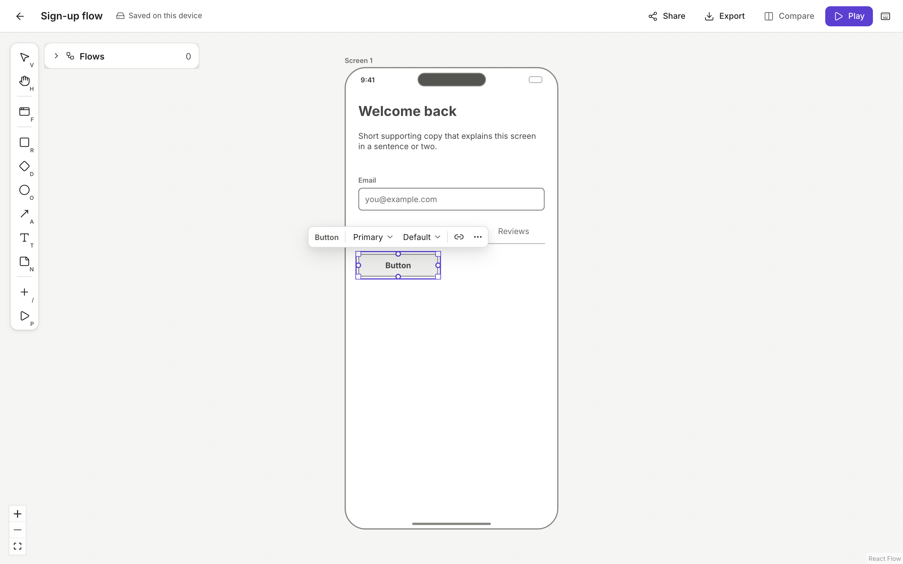
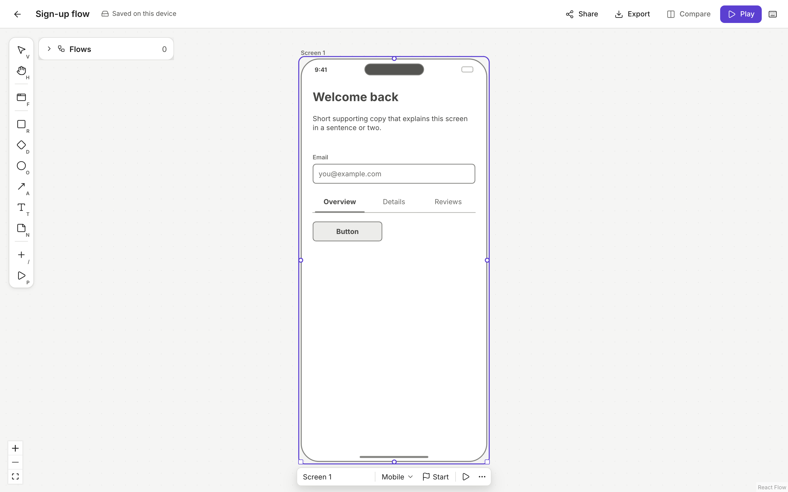

# Context bar and canvas feel: phase 3, wave C

## Summary
- **The context bar replaces the Inspector panel.** The right-hand panel is gone and the canvas now uses the full width. When you select something, a small floating bar appears just above it, or below it when there is no room at the top. The bar follows pan, zoom and drag, and it hides while you drag, resize, pan, marquee-select or edit text inline.
  - **Single kit element:** the bar is generated from the element's `editableProps`:
    - Fields marked `bar: 'inline'` sit on the bar. Other compact fields (select, boolean, icon, items) also sit on the bar, up to 3 in total.
    - Everything else (text, multiline, number) is in **More (⋯)**, together with W/H and the arrange actions (Duplicate ⌘D, Bring forward ⌘], Send backward ⌘[, Delete).
    - **Link** opens the existing link picker (`runCommand('link')`).
    - Main text is still edited inline on the canvas (double-click or Enter).
  - **Screen:** inline name, Device (Mobile/Tablet/Desktop), a Start screen toggle, Play (`runCommand('play')`) and More.
  - **Several items:** align left/centre/right/top/middle/bottom, distribute horizontally/vertically (needs 3 or more), and More (duplicate, order, delete).
  - **Connectors** never show this bar. The flows `EdgeControls` toolbar handles them, and the context bar copies its look (white pill, hairline border, shadow 2, 28px buttons).
- **Field controls:**
  - A select becomes a compact menu button that reads "State: Default". It opens a Radix radio menu.
  - A boolean becomes a toggle button with `aria-pressed`.
  - An icon field opens a searchable 8-column grid built from `KIT_ICON_NAMES`. Use arrow keys in the grid; Enter in the search box picks the first match.
  - An items field ("Edit tabs (3)") opens a list editor:
    - rename rows in place;
    - Enter adds a row below; Backspace on an empty row removes it;
    - Alt+↑/↓ reorders and ↑/↓ moves between rows;
    - each row also has buttons to move it up, move it down and remove it.
    - The list is stored back as `'a, b, c'`.
  - Every edit is one `apply(op, { label: 'Edit <Field>', mergeKey: 'props:<id>:<key>' })`, so a typing burst is one undo step.
- **Insert palette sections.** Wireframe components are grouped by `def.group`, in this order: Text, Buttons & actions, Form inputs, Navigation, Content & layout, Feedback & overlays, with "Components" as the fallback. Shapes and Screens follow.
  - The palette also has an **Arrow (connector)** entry, which switches to the Arrow tool (A).
  - An **Icons** section shows one compact tile per icon. Each tile inserts an `icon` element with `{ glyph: name }`; the key is derived from the Icon def's `kind: 'icon'` field.
  - Searching "arrow" finds both the Arrow tool and the arrow icons. Tiles are moved with ←/→ and ↑/↓ (grid-aware).
- **Snapping.** Moves now snap in three ways, in priority order:
  1. **Neighbour alignment** (edges and centres; this existed already).
  2. **Equal spacing.** When the gap to one neighbour matches the gap between two others, or when the item sits centred between two neighbours, dashed gap guides appear.
  3. **The 8px grid**, on any axis where nothing above applied.

  Resize already snapped to 8px. Hold Alt/Option to turn all snapping off.
- **Dot grid.** The canvas background shows dots on a 24px grid in `--fs-grid-dot` (gray-3). The grid is hidden below 40% zoom, so zoomed-out boards stay calm.
- **Muted grey kit.** Components and device frames are drawn with kit tokens inside a kit scope (`.fs-kit-scope` on `KitItemView`, plus `[data-kit-style][role='group']` used by the device frame and the gallery/export renderers). App chrome, selection and link accents are unchanged. The canvas, export (PNG/PDF), the share page and the gallery all reuse the kit renderers, so they get the same look.

## Keyboard
- **⌘/Ctrl + .** (or **Alt+F10**, the usual "go to toolbar" key) moves focus from the canvas into the bar. It is listed in the `?` dialog under Edit.
- **←/→, Home, End** move between bar controls (roving tabindex; only one control is tabbable). Arrows are left alone inside text inputs.
- **Esc** closes a popover and returns focus to its bar button. Esc on the bar returns focus to the selected node on the canvas without changing the selection.
- The bar is `role="toolbar"` and is named after the selection: "Button options", "Screen options" or "3 items options". Popovers are Radix dialogs and menus, so the editor's shortcuts ignore keys typed in them.

## How to try it
1. `npm run dev`, then create a board and open it. Press **F**, then **1**, then **Enter** to place a mobile screen.
2. Press **/**, type `button`, then press **Enter**. The bar shows Button · Style · State · Link · ⋯.
3. Open **State**, pick **Disabled**, then press **Esc** to go back to the canvas. Press **⌘Z** to revert it in one step.
4. Insert **Tabs** and choose **Edit tabs**. Rename a row, press Enter to add one, use Alt+↑ to reorder, then Esc.
5. Shift-click two elements, then choose **Align left**.
6. Drag a rectangle around the canvas: it lands on 8px positions. Hold Alt to place it freely.
7. Press **/**, type `bell`, then press **Enter** to insert an icon. Change it with the icon button on the bar.

## Design choices
- **Inline vs More.** Kit authors decide what goes on the bar with `bar: 'inline' | 'more'`. Without that hint, only compact controls go on the bar, so the bar stays at about 6 controls or fewer. Text fields go in More because the main text is edited on the canvas.
- **A dropdown menu instead of segmented buttons** for selects. Labels like "Primary" and "Default" stay readable at any zoom, and the bar width stays stable when options change.
- **Play** starts the flow of the selected screen from its start screen. It does not play "from this screen", because the Play view always starts from the flow's start.
- **Popovers have no enter animation.** If Esc landed while Radix Presence was still animating a popover open, the popover could stay open.
- **Bar placement.** The bar sits above the selection, including the screen's title row. If there is no room above, it goes below, and it is always clamped 8px inside the canvas. While shown, it can cover an element just above the selection, as in Whimsical.

## Architecture
- `src/editor/features/components/ContextBar.tsx` is registered on the `canvas` slot (`extensions.tsx`, id `context-bar`). It contains:
  - the variants `ElementBar`, `ScreenBar` and `MultiBar`;
  - the field controls `SelectMenu`, `IconPicker`, `ItemsEditor`, `BarText`, `BarNumber` and `FormField`;
  - `MoreMenu` (fields, W/H, Duplicate/order/Delete, which reuse `duplicateSelection`, `reorder` and `deleteNodes`).
- `contextBarFields.ts`: pure helpers `splitFields` (bar vs More), and `splitItems` / `joinItems` (item list encoding).
- `bridge.ts`: `setEditingId` / `useEditingId`. `CanvasLayer` publishes the inline editor's target so the bar can hide while you edit.
- `src/editor/snap.ts`: `snapBox(box, targets, threshold, { grid, spacing })` priority is line, then spacing, then grid. Guides have `kind: 'gap'` for spacing hints.
- `src/flow/FlowCanvas.tsx`: `SNAP_GRID = 8` for moves, `DotGrid` (hidden below `DOTS_MIN_ZOOM = 0.4`).
- `src/design/tokens.css` (kit scope) and `primitives.tsx` (`toneVar(tone, role)` resolves `ink`/`muted`/fills to `--fs-kit-*` with chrome fallbacks).
- Removed: `InspectorPanel.tsx`, the `rightPanel` registration and the inspector CSS. `src/chrome/Inspector.tsx` stays, because the `/chrome` dev page still uses it.

## Tests
- **Vitest:**
  - `snap.test.ts` (13): grid fallback, line priority over grid, equal gaps and centring between neighbours.
  - `contextBarFields.test.ts` (6): placement rules, cap, every kit field placed exactly once, Button layout, items encoding.
  - `paletteItems.test.ts`: groups and order, icon entries with `glyph`, Arrow tool, "arrow" and "phone" ranking.
  - `contrast.test.ts`: AA for `--fs-kit-text` and `--fs-kit-text-muted` on surface, canvas and kit fill; tokens only inside the kit scope; strokes quieter than ink; grayscale only.
- **Playwright `e2e/components.spec.ts` (13):**
  - Context bar on a screen: device, start screen, Label in More, W, and the Esc focus chain.
  - ⌘. focus, arrow roving, Button State → Disabled, then undo.
  - Tabs list editor: rename, add, reorder, remove.
  - Multi-select, then Align left.
  - Grid snap on drag (multiples of 8), and Alt to place freely.
  - Icons section and Arrow tool search, then the icon picker.
  - Existing resize and keyboard tests now read W from More.
- The full suite passes (43). The director demo is unchanged; its step-04 screenshot name still says "inspector".
