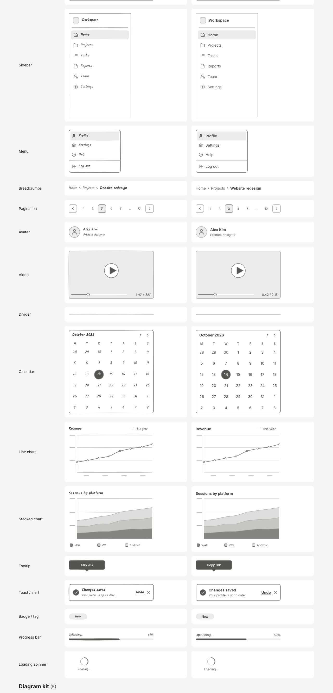

# Wireframe kit set B: phase 3, wave C

## Summary
- **15 new wireframe components** for navigation, content and feedback, all registered in `src/kit/wireframe/setB.ts`. Each one has a group, search keywords, sizes that fit a 375px mobile screen, a screen-reader `describe`, and 1–3 props marked `bar: 'inline'` for the context bar.
  - Navigation: **Sidebar**, **Menu**, **Breadcrumbs**, **Pagination**.
  - Content: **Video**, **Avatar**, **Calendar**, **Line chart**, **Stacked chart**, **Divider**.
  - Feedback: **Tooltip**, **Toast / alert**, **Badge / tag**, **Progress bar**, **Loading spinner**.
- **Existing components extended** (same prop keys and comma-separated values, so old boards and templates keep working):
  - **Header** has a new `variant: 'app' | 'web'` (default `'app'`). The web variant draws a desktop top nav: logo, title, link row (`links`), optional search, and a CTA button or avatar on the right (`right`, `cta`).
  - **Navigation bar** is renamed **Mobile tab bar** (the type stays `nav`).
  - **Tabs** (tab names), **Dropdown** (options), **List** (items) and **Table** (columns) now use kind `'items'`, so they're edited as lists.
  - Every set B component has a `group`: navigation (header, nav, tabs + new), inputs (dropdown), content (image, card, list, table + new), feedback (modal + new).
- Everything is grayscale and uses kit tokens only (no accent colour on the canvas). Every component renders in both clean and sketchy styles through the shared primitives.

## Components and props
| Component | Type | Default size | Props (**inline** in the context bar) |
|---|---|---|---|
| Sidebar | `sidebar` | 240×400 | **items**, **active**, title, collapsed, showIcons |
| Menu | `menu` | 200×165 | **items**, **highlight**, showIcons, divider (before the last item) |
| Breadcrumbs | `breadcrumbs` | 327×24 | **items**, separator (chevron/slash) |
| Pagination | `pagination` | 327×36 | **current**, **total**, showLabels |
| Video | `video` | 327×184 | **progress**, title, time, controls |
| Avatar | `avatar` | 220×48 | **name**, **initials**, subtitle, size, showName, status |
| Calendar | `calendar` | 327×320 | **month**, **selected**, rangeEnd, weekStart |
| Line chart | `line-chart` | 327×200 | **title**, **shape**, points, legend, showDots |
| Stacked chart | `stacked-chart` | 327×220 | **title**, **series** (2–4), shape, points |
| Divider | `divider` | 327×24 | **label**, orientation |
| Tooltip | `tooltip` | 140×44 | **text**, **arrow** (top/bottom/left/right), theme (dark/light) |
| Toast / alert | `toast` | 327×64 | **kind** (info/success/warning/error), **title**, message, action, showClose |
| Badge / tag | `badge` | 72×24 | **label**, **variant** (solid/soft/outline), dot, removable |
| Progress bar | `progress` | 327×40 | **value**, **variant** (bar/steps), label, showValue, steps |
| Loading spinner | `spinner` | 120×72 | **label** |

## How to try it
1. `npm run dev`, then open `/gallery`. Every kit item is shown in both styles; the set B items start at "Sidebar".
2. On a board, press **/** and type `sidebar`, `menu`, `toast`, `chart` or `calendar`, then press **Enter**.
3. Select a Header and switch **Variant** to *web*. Edit **Links** in the list editor.
4. Resize a Breadcrumbs element narrower: the middle items collapse to "…". Narrow a Pagination: page numbers drop out before the arrows do.

## Design choices
- **Lo-fi greys only.** Selected and active states (calendar day, active sidebar or menu item, current page) use an ink fill or a faint fill, never the violet accent. The violet is reserved for app selection and links.
- **Toast kinds** are told apart by icon (info / check / alert / close-in-circle) and a heavier left stripe, not by colour.
- **Charts** are deterministic. A `shape` (rising / falling / wave / flat) plus `points` generates a stable series, so the same board always looks the same. Stacked series use 4 grey fills (line / faint / hairline / hover tones) with ink strokes.
- **Icons** in the sidebar and menu are picked from the item label with a small heuristic (`iconForLabel`: "Settings" → gear, "Log out" → log-out, and so on), with fallbacks. They are lucide icons via `KitIcon`, coloured with tokens.
- **Spinner** is static (a thick arc over a thin track): calm on the canvas, and there's no motion to respect `prefers-reduced-motion` for.
- **Active and selected indices stay 0-based numbers** for back-compat, labelled "Active tab" / "Active item".
- **Calendar** shows days outside the month in the muted tone rather than with opacity, so the text keeps AA contrast. `month` is free text (for example "October 2026") and is parsed, falling back to a fixed month.
- **Graceful shrinking.** Text gets an ellipsis, link rows, page numbers, legends and subtitles are hidden first, and the tests render every component at its minimum size.

## Architecture
- One file per component in `src/kit/wireframe/`, following `button.tsx`.
- Shared helpers are appended in one commented block at the end of `_helpers.tsx`:
  - `IconAt` places a token-coloured icon.
  - `iconForLabel` picks an icon from a label.
  - `chartSeries`, `CHART_SHAPES` and `hash01` generate chart series.
- Pure exports for testing:
  - `pageList` (pagination ellipsis logic)
  - `monthLayout` (6×7 grid)
  - `bubblePoints` (tooltip outline)

## Tests
- `src/kit/wireframe/setB.test.tsx` covers:
  - metadata: group, keywords, 1–3 inline props, sizes ≤ 375 wide
  - rendering at default, min and wide sizes in both styles, including junk or empty props and every select option
  - header back-compat and the web variant; tab names; menu fitting; breadcrumb collapse
  - `pageList`, `monthLayout`, `chartSeries`, `iconForLabel`, and the descriptions
- `npx tsc -b` is clean and `npm run lint` exits 0.
- `npx vitest run src/kit`: 595 tests pass. The 9 failures are outside set B: Kit A's `caption` and `link` renders, plus the known "registers all 16" test owned by the Orchestrator.

## Risks
- **`_helpers.tsx` is append-only for both kit agents.** Kit A's and Kit B's blocks need a clean merge.
- **Kit palette contrast.** The `.fs-kit-scope` remap makes ink fills mid-grey, and ink vs faint strokes are close. Chart and selection states lean on fills, so check them on real screens.
- **The stacked chart and legend swatches use raw `var(--fs-line/hairline/hover)` fills** because `Tone` has no such values. They follow the tokens, but not the kit remap.
- **Lucide icons are not sketchy** in sketchy mode (the same as Kit A's icon).
- **Text-fit estimates** (about 7px per character for breadcrumbs and the header link row) can be off for long or localised labels.

## Open questions
1. Should active and selected indices be shown 1-based in the context bar? They're stored 0-based.
2. The web header default size has to stay ≤ 375 wide (a `kit.test` rule), so it is inserted at app width. Should the web variant switch the size, or should the rule exempt desktop items?
3. Is the avatar `size` select needed when you can already resize the element?
4. Is the icon heuristic for the menu and sidebar enough, or do we want a per-item icon picker in the items editor?

## Parking lot
- Per-item icons in the `items` editor.
- Real date maths: a range across months, and locale week starts beyond Monday and Sunday.
- An optional animated spinner (honouring reduced motion).
- Editable chart data and axis labels.
- A tooltip/menu anchored to another element.
